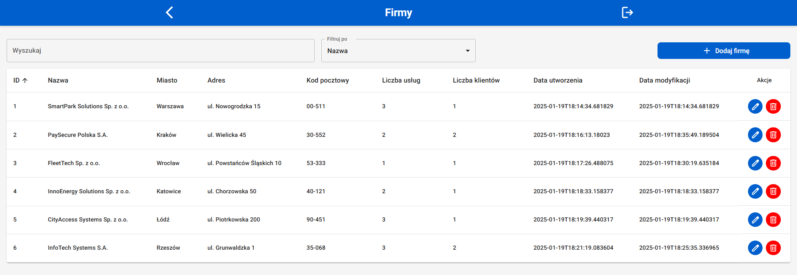
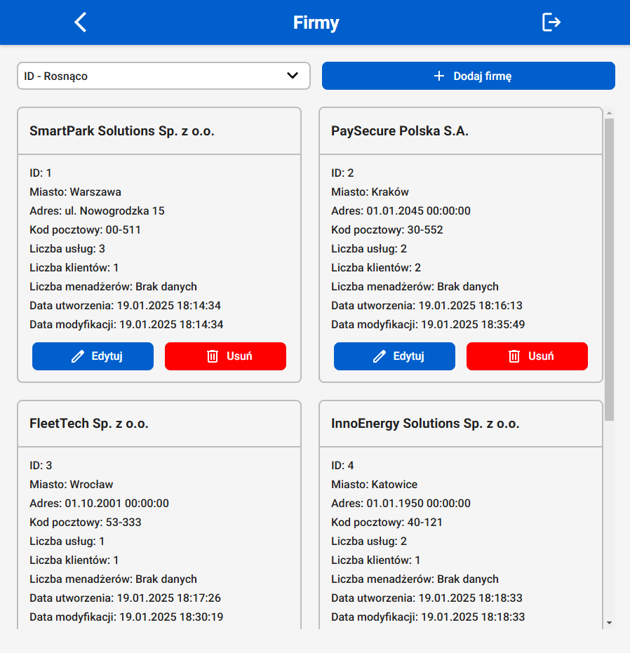
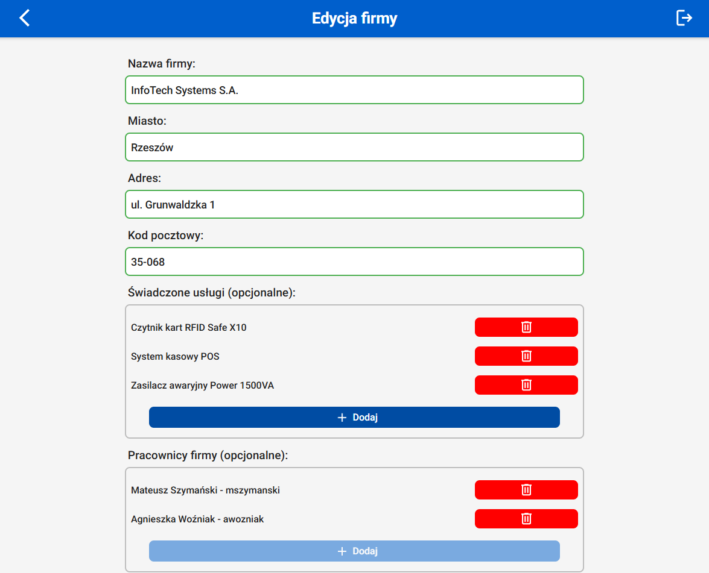
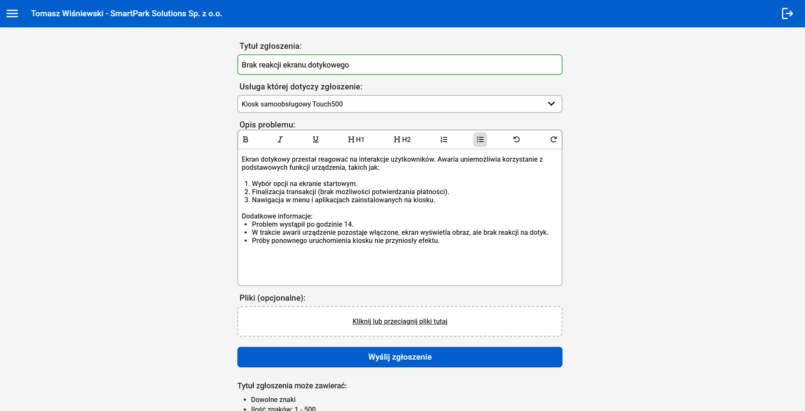
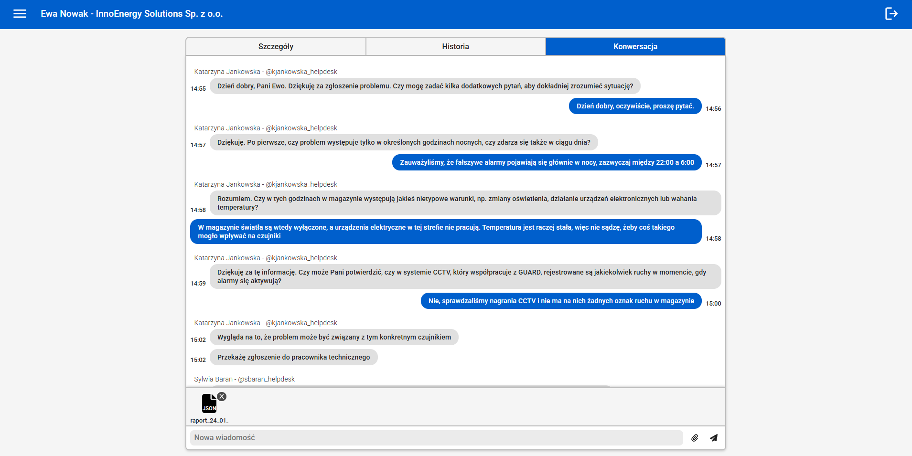
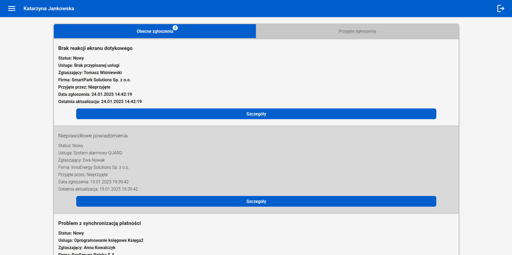
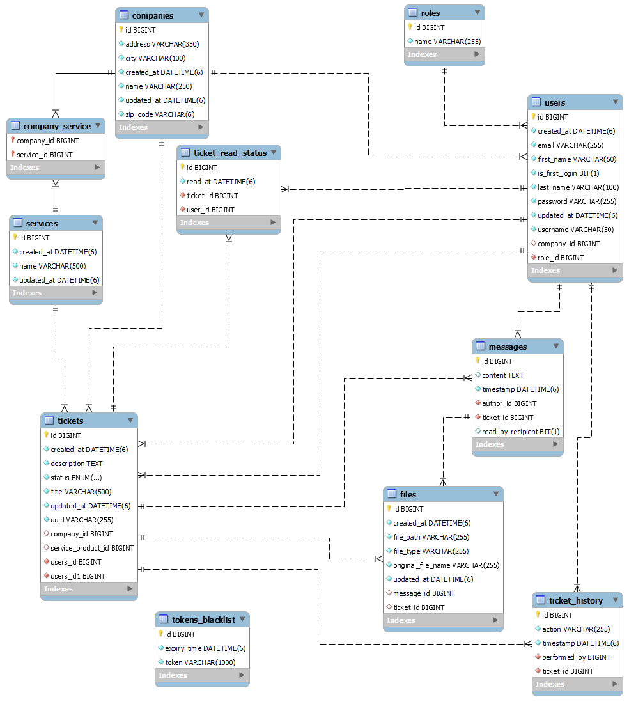

# 🎫 Enterprise Helpdesk & Ticketing Platform

A modular, full-stack enterprise platform for support ticket workflows, B2B service management, and real-time messaging. Developed as a B.<span></span>Sc. Eng. Thesis project at Rzeszow University of Technology (Spring Boot 3 / Java 22, React 18, MySQL 8).

---

## 🎥 Previews

#### Administrator's company management panel



|                                 Administrator company management panel – mobile view                                  |                           Company data editing panel for administrators                           |
| :-------------------------------------------------------------------------------------------------------------------: | :-----------------------------------------------------------------------------------------------: |
|  |  |

#### Customer ticket submission panel



#### Conversation section during ticket handling



#### Main employee dashboard with all active tickets



## ⚡ Key Architectural Features

- Role-Based Access Control (RBAC): Distinct modules and secured endpoints tailored for ADMIN, EMPLOYEE, and CLIENT roles with complete data and interface isolation.
- Enterprise-Grade Stateless Security: Authentication driven by cryptographically signed JWT tokens transmitted via secure SSL/TLS cookies. Features backend token blacklisting (tokens_blacklist) to instantly invalidate sessions upon logout.
- Full-Duplex Real-Time Communication: Spring WebSocket integration utilizing a STOMP message broker and SockJS fallback to power live ticket board synchronization and instant two-way messaging between clients and assigned support staff.
- Rich-Text Formatting & File Uploads: Integrated Draft.js rich-text editor for detailed problem descriptions (headings, lists, text formatting) and a drag-and-drop file upload zone with strict extension blacklisting (.exe, .sh, .bat).
- Ticket Lifecycle & Reassignment Engine: Full audit trail tracking (ticket_history), ticket reassignment workflows between team members, and real-time visual pulse animations highlighting newly transferred tickets.
- Centralized Error Handling & Two-Tier Validation: Global @RestControllerAdvice mapping domain exceptions to uniform API responses (ApiResponse) without exposing sensitive database schemas. Backed by client-side regex rules and backend Bean Validation (@Pattern, @Size, @Email).
- Automated Environment Bootstrap: CommandLineRunner DataInitializer automatically configuring the physical storage directories (uploads/tickets, uploads/chats), seeding base database roles, and creating the default administrator account on initial startup.

---

## 🗄️ Database Architecture (ERD)

The relational schema is built on top of MySQL 8 (InnoDB Engine) enforcing strict referential integrity, foreign key constraints, and cascading rules across 10 tables:

<p align="center">
  
</p>

- **Multi-Tenant Identity & Access Management:**
  - `users` & `roles`: Standard Role-Based Access Control (RBAC) mapping users to specific system privileges (`ADMIN`, `EMPLOYEE`, `CLIENT`).
  - `companies` & `services`: B2B tenant organization with an intermediate join table `company_service` supporting many-to-many service catalog assignments.
- **Core Ticket Management Engine:**
  - `tickets`: Central entity referencing the client (`users_id`), assigned technician (`users_id1`), requesting tenant (`company_id`), and contracted service (`service_product_id`). Identified additionally by unique `uuid`.
  - `ticket_read_status`: Dedicated tracking table persisting read receipts per user and ticket (`read_at`), ensuring unread state synchronization across dashboards.
  - `ticket_history`: Immutable audit trail recording user actions (`action`, `performed_by`, `timestamp`) across the complete ticket lifecycle.
- **Real-Time Communication & Unified File Storage:**
  - `messages`: Full-duplex conversation thread per ticket, containing rich content, timestamps, delivery tracking (`read_by_recipient`), and author binding.
  - `files`: Unified polymorphic file storage model attaching binary assets dynamically to either main tickets (`ticket_id`) or specific chat messages (`message_id`).
- **Stateless Session Security:**
  - `tokens_blacklist`: Autonomous invalidation store for revoked JWT hashes (`token`, `expiry_time`) invoked upon user logout.

---

## 🏗️ Project Structure

```
helpdesk-app/
├── backend/                             # Server-side application (Spring Boot 3 / Java 22)
│   └── src/main/java/com/example/backend/
│       ├── config/                      # Security, WebSockets, i18n, DataInitializer & GlobalExceptionHandler
│       ├── controller/                  # REST controllers & WebSocket STOMP endpoints (user, websocket)
│       ├── dto/                         # Data Transfer Objects segmented by domain (company, ticket, user, etc.)
│       ├── exception/                   # Domain-specific business exceptions and OperationType enum
│       ├── model/                       # Hibernate/JPA entity mappings & TicketStatus enum
│       ├── repository/                  # Spring Data JPA repositories
│       ├── security/                    # JWT authentication filter, token provider & payload models
│       └── service/                     # Transactional business services (user, ticket, file, message, etc.)
│
└── frontend/                            # Client-side single-page application (React 18)
    └── src/
        ├── api/                         # Axios service layer (ApiClient, TicketService, AuthService, etc.)
        ├── components/                  # Domain & UI widgets (TicketChat, TicketHistory, ArchiveTicketDetails, Loader)
        ├── context/                     # WebSocket STOMP and notification context providers
        ├── hooks/                       # Custom hooks (useUserForm, useFocusEnd)
        ├── redux/                       # Redux Toolkit store and slices (AuthSlice, UserSlice, LoadingSlice)
        ├── routes/                      # Route definitions, guards (ProtectedRoutes), and RouteManager
        ├── scss/                        # Modular SCSS stylesheets
        └── views/                       # Role-based dashboards (Admin, Client, Employee) & SignIn flow
```

---

## 🛠️ Tech Stack & Dependencies

- Backend:
  - Core Framework: Java 22, Spring Boot 3.2.5, Spring Web MVC
  - Build Tool: Gradle 8.8
  - Security & Auth: Spring Security 6, Auth0 Java-JWT, HttpOnly Secure Cookie Management
  - Persistence: Spring Data JPA, Hibernate ORM, MySQL Connector/J
  - Real-Time Messaging: Spring WebSocket, STOMP Message Broker, SockJS Protocol
  - Tooling: Project Lombok, Spring Boot DevTools, Internationalization Support

- Database:
  - Engine: MySQL 8 (InnoDB engine, strict foreign keys, UTF8mb4 encoding)

- Frontend:
  - Runtime & Framework: React 18.3, Node.js, JavaScript (ES6+)
  - State Management: Redux Toolkit, React-Redux, React Context API
  - Real-Time Client: @stomp/stompjs, SockJS-Client
  - Rich-Text Engine: Draft.js, draft-js-export-html, draft-js-import-html
  - UI Components & Icons: Material UI, Emotion, FontAwesome 6
  - Utilities & Routing: Axios, React Router DOM, React-Dropzone, Date-fns
  - Styling: SASS / SCSS Modules (Dart Sass)

---

## 🚀 Getting Started

#### 1. Database Setup

Create an empty MySQL database with full Unicode support:

`CREATE DATABASE helpdesk_app CHARACTER SET utf8mb4 COLLATE utf8mb4_unicode_ci;`

#### 2. SSL Keystore Generation

The backend requires a PKCS12 keystore to support HTTPS/WSS communication. Generate a local self-signed certificate in any directory of your choice:

```
keytool -genkeypair -alias helpdesk -keyalg RSA -keysize 2048 -storetype PKCS12 -keystore keystore.p12 -validity 3650 -storepass YOUR_STORE_PASSWORD -keypass YOUR_STORE_PASSWORD -dname "CN=localhost, OU=Helpdesk, O=HelpdeskApp, L=Rzeszow, ST=Podkarpackie, C=PL"
```

#### 3. Backend Configuration & Startup

Define all required runtime parameters via Environment Variables (or in IntelliJ IDEA: Run -> Edit Configurations... -> Environment Variables):

- DB_URL: JDBC connection URL (e.g. jdbc:mysql://localhost:3306/helpdesk_app)
- DB_USERNAME: Database username (e.g. root)
- DB_PASSWORD: Database password
- JWT_SECRET: Hexadecimal string for HMAC-SHA256 signature verification
- JWT_EXP: Token validity period in milliseconds (e.g. 86400000 for 24h)
- SERVER_ADDR: Server binding host (e.g. 127.0.0.1)
- SERVER_PORT: Server port (e.g. 8443)
- SSL_KEY: Path to the generated keystore. Use "file:/absolute/path/to/keystore.p12" (or "file:C:/path/to/keystore.p12" on Windows) if stored externally, or "classpath:keystore.p12" if placed inside src/main/resources
- SSL_PASS: Keystore password defined during keytool generation (YOUR_STORE_PASSWORD)

Run the Spring Boot application using Gradle:

```
cd backend
```

##### Linux / macOS / Git Bash:

```
./gradlew bootRun
```

##### Windows (CMD / PowerShell):

```
gradlew bootRun
```

(Alternatively, open the project in your IDE and launch BackendApplication.java directly).
(On initial launch, the built-in DataInitializer will automatically seed base system roles, register the initial administrator account, and prepare physical upload directories).

#### 4. Frontend Configuration & Startup

1. In the frontend root directory, create a .env file based on .env.example (ensure no spaces around =):

```
REACT_APP_API=https://127.0.0.1:8443/api
REACT_APP_WS=https://127.0.0.1:8443
```

2. Install project dependencies and start the React dev server:

```
cd frontend
npm install
npm start
```

3. Browser Security Exception (Self-Signed SSL):
   Before logging in, visit https://127.0.0.1:8443/api/auth/verify-token in your browser and accept the self-signed certificate warning (Advanced -> Proceed to 127.0.0.1 (unsafe) or type thisisunsafe). This enables the browser to trust local HTTPS/WSS API requests sent from localhost:3000.

---

## 👨‍💻 Academic Context & Authorship

- Author: Arkadiusz Przywara
- Degree: Bachelor of Science in Engineering (B.<span></span>Sc. Eng.) in Computer Science
- Institution: Rzeszow University of Technology
- Faculty: Faculty of Electrical and Computer Engineering
- License: MIT License
